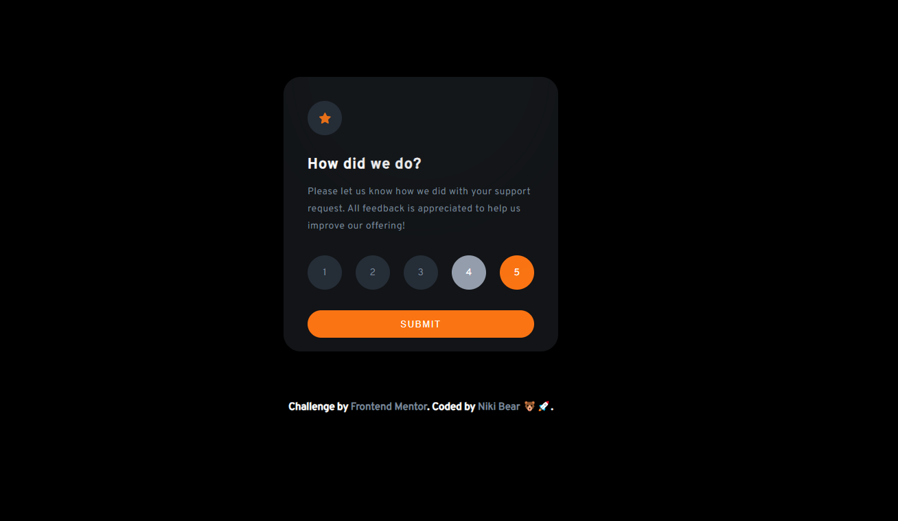
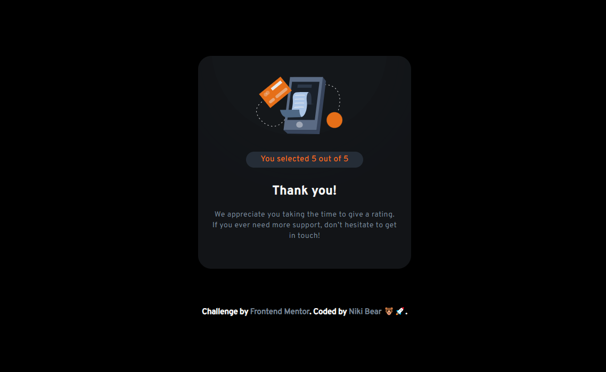

# Rating Component Challenge

 
 

## Welcome! 👋

Thanks for checking out this front-end challenge from [Frontend Mentor](https://www.frontendmentor.io).

## The challenge

Your challenge was to build a dynamic component where you could choose a rating from 1 to 5, submit it, and then have the component return the selected number along with a thank you message.

## Deployed project

This project was deployed using [Netlify](https://www.netlify.com/), check out the link below 😃.

[Rating Component](https://app.netlify.com/sites/rating-component-interactive-bear/overview)

Project made by **Niki Bear** 🐻🚀